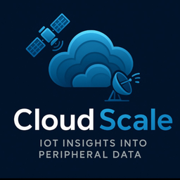

<div align="center">
  

  # Cloud-Scale

  **Industrial IoT Solutions from [cloud-scale.us](https://cloud-scale.us)**
</div>

Cloud-Scale provides enterprise-grade industrial monitoring and streaming solutions for manufacturing, logistics, and process control environments.

---

## Products

### Win-Scale - RTSP Scale Streamer

**Stream industrial scale weights as live video feeds**

Win-Scale is a Windows application that converts weight data from industrial scales into real-time RTSP video streams, enabling integration with video management systems (VMS), network video recorders (NVR), and web dashboards.

#### Features
- **Universal Scale Support**: TCP/IP and RS232 connectivity (Fairbanks 6011 protocol)
- **RTSP & HLS Streaming**: Industry-standard video protocols
- **Customizable Overlays**: Weight, timestamp, units, custom labels
- **Easy Integration**: Works with any VMS/NVR that supports RTSP
- **Zero Configuration**: Self-contained installer with all dependencies

#### Quick Start
```bash
# Install from MSI (Windows)
ScaleStreamerSetup.msi

# Or run from source
cd win-scale
dotnet publish -c Release -r win-x64 --self-contained
```

**View live stream:**
```
rtsp://localhost:8554/scale
```

[Full Documentation →](win-scale/README.md)

---

## Repository Structure

```
Cloud-Scale/
├── win-scale/              # RTSP Scale Streamer for Windows
│   ├── src/                # .NET 8 WinForms application
│   ├── installer/          # WiX MSI installer
│   └── README.md           # Product documentation
│
└── [future products]       # Coming soon
```

---

## Support & Contact

- **Website**: [cloud-scale.us](https://cloud-scale.us)
- **Issues**: [GitHub Issues](https://github.com/CNesbitt2025/Cloud-Scale/issues)
- **Email**: admin@cloud-scale.us

---

## License

Copyright © 2025 Cloud-Scale
All rights reserved.

Individual product licenses may vary - see product directories for details.
