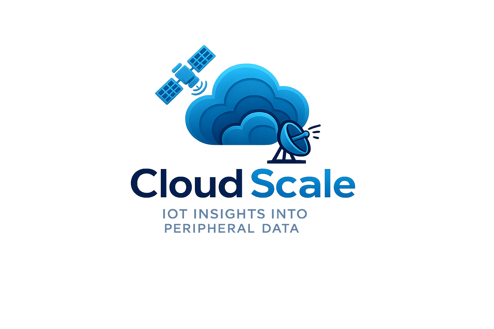

# Scale Streamer v2.0

**Universal Industrial Scale Data Acquisition Platform**

<p align="center">
  
</p>

A professional Windows service that connects to industrial scales using any protocol and streams weight data to your systems in real-time.

## 📥 Download

**[Download Latest Release (v2.0.1)](../../releases/latest)**

**Quick Install:**
1. Download `ScaleStreamer-v2.0.1-xxxxxxxx-xxxxxx.msi`
2. Run the installer (no .NET installation required - everything included!)
3. Launch "Scale Streamer Configuration" from Start Menu
4. Configure your scale connection
5. Service starts automatically

**File Size:** ~55 MB (self-contained, includes all .NET dependencies)

## ✨ Features

### Universal Protocol Support
- **Pre-built Protocol Templates**: Fairbanks, Toledo, Mettler Toledo, Rice Lake, and more
- **XML-Based Protocol Engine**: Create custom protocols without coding
- **Connection Types**: TCP/IP, Serial (RS232), UDP
- **Auto-Reconnect**: Robust connection handling with automatic recovery

### Professional Architecture
- **Windows Service**: Runs in background, starts automatically with Windows
- **Configuration GUI**: Modern WinForms interface for easy setup
- **Named Pipe IPC**: Secure communication between service and GUI
- **SQLite Database**: Persistent configuration storage
- **Real-time Monitoring**: Live weight data display and connection status

### Developer-Friendly
- **Protocol Templates**: Easy XML-based protocol definitions
- **Structured Logging**: Serilog with file and console output
- **Extensible Design**: Clean architecture for custom integrations
- **Self-Contained Deployment**: No runtime dependencies to install

## 🎯 Supported Scales

The universal protocol engine supports any scale with:
- TCP/IP, Serial (RS232), or UDP connectivity
- ASCII or binary data output
- Custom or standard protocols

**Pre-configured templates included for:**
- Fairbanks scales (all models)
- Toledo scales
- Mettler Toledo scales
- Rice Lake scales
- Avery Weigh-Tronix scales
- Generic ASCII weight output

**Don't see your scale?** Create a custom protocol template in minutes using our XML format (see documentation).

## 💻 System Requirements

- **OS**: Windows 10/11 or Windows Server 2016+ (64-bit)
- **.NET Runtime**: Not required (self-contained installer includes everything)
- **Disk Space**: ~200 MB
- **Permissions**: Administrator rights for installation (service runs as Local System)

## 🚀 Quick Start

### 1. Install
Download and run the MSI installer from the [Releases](../../releases) page.

### 2. Configure
Launch **Scale Streamer Configuration** from the Start Menu:
- Select **Connection** tab: Choose TCP/IP or Serial, enter scale IP/port or COM port
- Select **Protocol** tab: Choose your scale manufacturer or create custom protocol
- Click **Save Configuration**

### 3. Start Service
The service starts automatically after installation. You can also:
- Use Services (`services.msc`) to manage "Scale Streamer Service"
- Check **Status** tab in Configuration GUI for live connection status

### 4. Monitor
Use the **Monitoring** tab to see real-time weight data from your scale.

## 📖 Documentation

- **[Quick Start Guide](QUICK-START-V2.md)** - Get started in 5 minutes
- **[Build Instructions](BUILD-AND-TEST-V2.md)** - Build from source
- **[Architecture Overview](V2-UNIVERSAL-ARCHITECTURE.md)** - Technical architecture
- **[Protocol Templates](protocols/)** - XML protocol definitions
- **[Master Restoration Guide](CLAUDE.md)** - Complete project documentation

## 🔧 Configuration

### Connection Settings

#### TCP/IP Mode
- **Host**: IP address of the scale (e.g., `10.1.10.210`)
- **Port**: TCP port (default: `5001`)

#### Serial Mode
- **Port**: COM port (e.g., `COM1`, `COM2`)
- **Baud Rate**: Communication speed (9600, 19200, 38400, 57600, 115200)
- **Data Bits**: Usually 8
- **Parity**: None, Even, Odd
- **Stop Bits**: 1 or 2

### Protocol Configuration

Choose from built-in templates or create custom XML protocol definitions. See `protocols/` directory for examples.

**Example Protocol Template (Fairbanks):**
```xml
<ScaleProtocol name="Fairbanks Standard">
  <Manufacturer>Fairbanks</Manufacturer>
  <ConnectionType>TcpIp</ConnectionType>
  <DataFormat>
    <Encoding>ASCII</Encoding>
    <LineEnding>CRLF</LineEnding>
  </DataFormat>
  <WeightParser>
    <Pattern>STATUS\s+WEIGHT\s+TARE</Pattern>
    <WeightGroup>2</WeightGroup>
  </WeightParser>
</ScaleProtocol>
```

## 🏗️ Building from Source

### Prerequisites
- .NET 8.0 SDK
- WiX Toolset v4 (for installer builds)
- Git

### Build Steps

1. **Clone the repository:**
   ```powershell
   git clone https://github.com/CNesbitt2025/Cloud-Scale.git
   cd Cloud-Scale
   ```

2. **Build self-contained binaries:**
   ```powershell
   cd installer
   .\build-self-contained.ps1
   ```

3. **Build installer:**
   ```powershell
   .\build-installer-selfcontained.ps1
   ```

The MSI installer will be created in `installer/bin/` directory.

See **[BUILD-AND-TEST-V2.md](BUILD-AND-TEST-V2.md)** for detailed build instructions.

## 📂 Project Structure

```
win-scale/
├── src-v2/                           # v2.0 source code
│   ├── ScaleStreamer.Service/        # Windows Service (background process)
│   ├── ScaleStreamer.Config/         # Configuration GUI (WinForms)
│   ├── ScaleStreamer.Common/         # Shared library (protocol engine)
│   └── ScaleStreamer.Tests/          # Unit tests
├── protocols/                        # Protocol template XML files
├── installer/                        # WiX installer scripts and assets
├── assets/                           # Logo, icons, branding
└── CLAUDE.md                         # Master restoration guide

```

## 🐛 Troubleshooting

### Service won't start
- Check Windows Event Viewer for error details
- Verify administrator rights during installation
- Check `C:\ProgramData\ScaleStreamer\logs\` for service logs

### Can't connect to scale
- **TCP/IP**: Verify scale IP address and port, check firewall, ping scale
- **Serial**: Verify COM port number in Device Manager, check baud rate matches scale
- Use **Test Connection** button in Configuration GUI
- Check logs in **Logs** tab

### No weight data received
- Verify scale is configured to transmit data continuously
- Check protocol template matches your scale's output format
- View raw data in **Monitoring** tab to verify data is being received
- Compare with protocol template regex patterns

### Configuration GUI won't launch
- Ensure service is running (`services.msc`)
- Check named pipe is available (may need reboot if Windows updates installed)
- Run as Administrator if IPC connection fails

## 🚀 Roadmap

- [ ] RTSP video streaming (weight display as video feed)
- [ ] REST API for weight data access
- [ ] Cloud synchronization
- [ ] Data analytics and reporting
- [ ] Mobile app (iOS/Android)
- [ ] Web dashboard
- [ ] Multi-scale support (connect multiple scales)

## 📄 License

MIT License - See [LICENSE](LICENSE) file for details

## 🙏 Credits

Built with:
- .NET 8.0
- Serilog (logging)
- SQLite (database)
- WiX Toolset (installer)

## 💬 Support

- **Issues**: [GitHub Issues](../../issues)
- **Documentation**: See `docs/` directory
- **Email**: support@cloud-scale.us

---

**Made with ❤️ for industrial automation**
